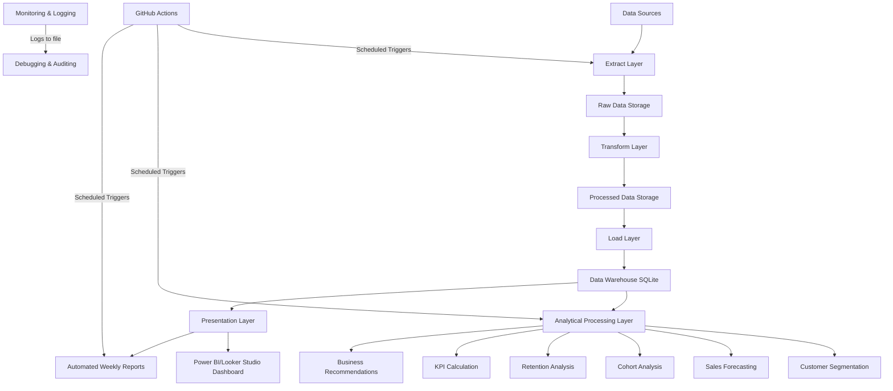

# E-Commerce Business Intelligence Platform Architecture

## Overview
This document describes the architecture of the End-to-End Business Intelligence Platform for an E-commerce Company. The platform follows a modern data warehouse architecture with ETL pipelines, analytical processing, and visualization layers.

## Architectural Layers

### 1. Data Sources Layer
- **Primary Data**: Online Retail II dataset (UCI Machine Learning Repository)
- **Supplemental Data**: Synthetically generated data for marketing, inventory, returns, and customer support
- **External Sources**: Public APIs for currency exchange rates (if needed), holiday calendars

### 2. Data Ingestion Layer
- **Extraction Scripts**: Python scripts to download and ingest raw data
- **Storage**: Raw data stored in `data/raw/` as CSV/Excel files
- **Orchestration**: ETL pipeline coordinates extraction, transformation, and loading

### 3. Data Storage Layer (Data Warehouse)
- **Technology**: SQLite (file-based, zero-administration SQL database)
- **Schema**: Star schema with fact and dimension tables
- **Tables**:
  - Fact Table: `fact_sales` (transactional data)
  - Dimension Tables: 
    - `dim_date` (time dimension)
    - `dim_customers` (customer attributes and segmentation)
    - `dim_products` (product details and categories)
    - `dim_orders` (order status and fulfillment)
    - `dim_payments` (payment method information)
    - `dim_returns` (return reasons and details)
    - `dim_marketing` (campaign and channel performance)
- **Optimization**: Indexes on foreign keys and frequently queried columns
- **Views**: Pre-built analytical views for common queries
- **Stored Procedures**: Reusable SQL snippets for complex calculations

### 4. Data Processing Layer (ETL)
- **Extraction**: 
  - Download raw data from public sources
  - Handle multiple file formats (CSV, Excel)
  - Basic validation and error handling
- **Transformation**:
  - Data cleaning: deduplication, missing value imputation, outlier detection
  - Standardization: text normalization, data type conversion
  - Enrichment: calculated fields, segmentation, derived metrics
  - Integration: joining with dimension tables to create star schema
- **Loading**:
  - Create database schema if not exists
  - Load cleaned data into dimension and fact tables
  - Update indexes and refresh materialized views
  - Data validation and quality checks

### 5. Analytical Processing Layer
- **Customer Segmentation**: RFM analysis and clustering
- **Sales Forecasting**: Time series models (linear regression, moving average, exponential smoothing, ARIMA)
- **Cohort Analysis**: Customer lifecycle and retention analysis
- **Retention Analysis**: Churn prediction and at-risk customer identification
- **KPI Engine**: Automated calculation of business metrics
- **Business Rules Engine**: Data-driven recommendation generation

### 6. Presentation Layer
- **Dashboard**: Interactive visualizations (Power BI Desktop or Looker Studio)
- **Reports**: Automated weekly executive reports (PDF, Excel, CSV)
- **Notifications**: Alerting for significant metric changes (configurable)
- **Ad-hoc Querying**: Direct SQL access for analyst exploration

### 7. Automation & Orchestration Layer
- **Scheduler**: GitHub Actions for scheduled pipeline runs
- **Monitoring**: Logging and basic health checks
- **Version Control**: Git for code and configuration management
- **Testing**: Automated unit and integration tests

## Data Flow

1. **Extract**: Raw data downloaded from UCI repository and saved to `data/raw/`
2. **Transform**: 
   - Cleaned and standardized in `etl/transform.py`
   - Dimensions and fact table created in memory
   - Saved to `data/processed/` for auditing
3. **Load**: 
   - Data warehouse created/updated in `data/warehouse/ecommerce_bi.db`
   - Schema, tables, indexes, and views deployed
   - Data loaded into star schema
4. **Analyze**: 
   - Analysis scripts read from the data warehouse
   - Generate segments, forecasts, insights, and recommendations
   - Save results to `data/processed/` or regenerate on demand
5. **Visualize**: 
   - Dashboard connects directly to the data warehouse
   - Reports extract data and generate formatted output
6. **Automate**: 
   - GitHub Actions triggers pipeline on schedule
   - Weekly report generation and distribution

## Key Design Principles

### Modularity
- Each major function (extract, transform, load, analyze, report) is in separate modules
- Clear interfaces between components via well-defined data structures
- Reusable utility functions in `etl/utils.py`

### Scalability
- Star schema optimized for analytical queries
- Indexing strategy for common query patterns
- ETL pipeline designed to handle incremental loads (can be extended)

### Maintainability
- Comprehensive logging at each stage
- Configuration via environment variables and config files
- Documentation embedded in code (docstrings) and separate docs/
- Consistent coding standards (PEP8, type hints where applicable)

### Reliability
- Error handling and recovery mechanisms
- Data validation at each stage
- Verification steps after data loading
- Rollback capabilities in ETL pipeline (transaction-like behavior for SQLite)

### Security
- No hardcoded credentials
- SQLite file permissions restrict access
- Audit trails via logging
- Data minimization principles (only store necessary data)

## Technology Choices Justification

### SQLite for Data Warehouse
- **Pros**: Zero configuration, file-based, ACID compliant, SQL support, sufficient for demo/portfolio project
- **Cons**: Limited concurrent writes, not ideal for massive scale
- **Justification**: For a portfolio project demonstrating end-to-end BI, SQLite provides all necessary features without operational complexity

### Python for ETL and Analysis
- **Pros**: Rich ecosystem (pandas, numpy, scikit-learn, matplotlib), excellent for data manipulation, wide adoption in data science
- **Cons**: Not compiled language (performance considerations for massive scale)
- **Justification**: Industry standard for data engineering and analytics tasks, perfect for demonstrating skills

### Power BI Desktop / Looker Studio for Visualization
- **Pros**: Free tiers available, powerful visualization capabilities, business-user friendly
- **Cons**: Limited to desktop (Power BI) or web-only (Looker Studio) in free versions
- **Justification**: Both are industry-leading tools that professionals are expected to know

### GitHub Actions for CI/CD
- **Pros**: Free for public repositories, integrates seamlessly with GitHub, supports complex workflows
- **Cons**: Limited to GitHub ecosystem
- **Justification**: Demonstrates DevOps awareness and automation skills valued in modern data roles

## Extensibility Points

### Adding New Data Sources
1. Create new extractor function in `etl/extract.py`
2. Add transformation logic in `etl/transform.py` if needed
3. Update star schema with new dimensions/fact columns
4. Modify loading scripts in `etl/load.py`
5. Update dashboard to include new metrics

### Adding New Analytical Models
1. Implement new analysis function in `analysis/` directory
2. Follow the pattern of existing modules (data loading, computation, visualization)
3. Register in any orchestrator if needed
4. Update documentation

### Changing Visualization Tool
1. The analytical layer produces data and insights
2. Presentation layer can be swapped by changing the connection method
3. Dashboard-specific measures would need to be recreated in the new tool

### Scaling to Enterprise Data Volumes
1. Replace SQLite with PostgreSQL, Amazon Redshift, Google BigQuery, or Snowflake
2. Update connection strings in `etl/utils.get_db_connection()`
3. Adjust SQL dialect if necessary (use SQLAlchemy for abstraction)
4. Consider partitioning strategies for fact tables
5. Implement incremental loading patterns

## Deployment Considerations

### Development Environment
- Python 3.9+
- Required Python packages (see requirements.txt)
- Git for version control
- Power BI Desktop (free) or access to Looker Studio

### Production-like Environment
- Same as development but with scheduled automation
- Regular data refreshes (daily/hourly via GitHub Actions or external scheduler)
- Monitoring and alerting for pipeline failures
- Backup strategy for the SQLite database file

### Cloud Deployment Options
- The entire stack can be deployed to cloud VMs or containers
- SQLite can be replaced with cloud-managed data warehouses
- ETL scripts can be deployed to AWS Lambda, Google Cloud Functions, or Azure Functions
- Dashboard can be published to Power BI Service or Looker Studio sharing

## Diagram

## Conclusion
This architecture provides a complete, end-to-end Business Intelligence platform that demonstrates essential skills for data engineering, BI analysis, and analytics engineering roles. It covers data ingestion, storage, processing, analysis, visualization, and automation using industry-standard tools and practices.